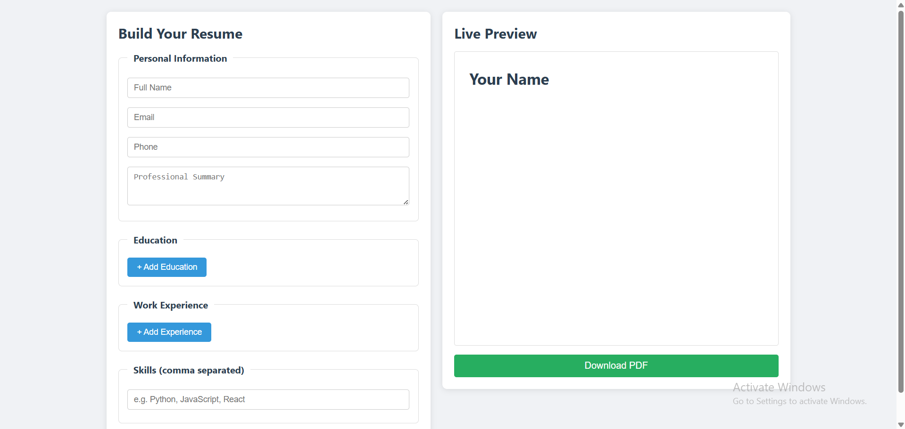
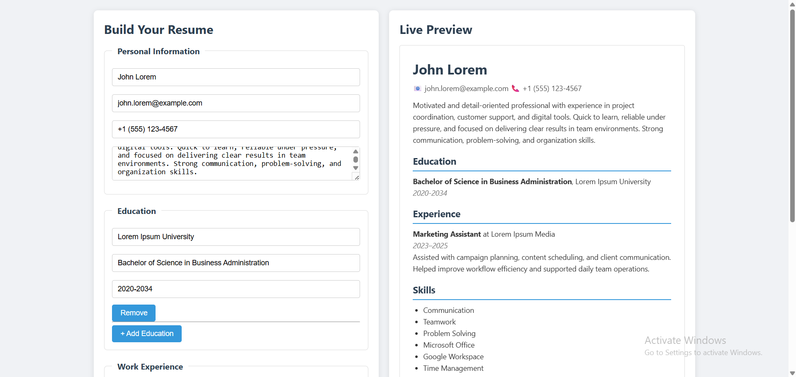

**Project description & the problem it solves:**\
If you would like to get a job, you would need to prepare a resume
to show your experience and skills. This project does just that:
it prepares a pdf document with applicant information to apply
for jobs.

**Features and functionality of the web application:**\
The website allows to create a resume by filling in name,
contact information, degree, and experience. No section is 
required, so it would fit nicely any person. The site provides
live preview of the resume, and the resulted pdf is guaranteed
to look the same as the preview.

**Architecture overview (frontend, backend, API, database):**\
frontend, backend

**Tech stack (e.g., HTML, CSS, JavaScript, React, Node.js, etc.):**\
Flask, HTML, CSS, JavaScript

**Setup & run instructions:**\
Simply prepare python interpreter ready to process Flask application

**Screenshots or UI diagrams**

**Demo Video:**\
https://drive.google.com/file/d/18h5ZuGBEzV5ngTeZikKb6FhORm0zvkyB/view?usp=drive_link

